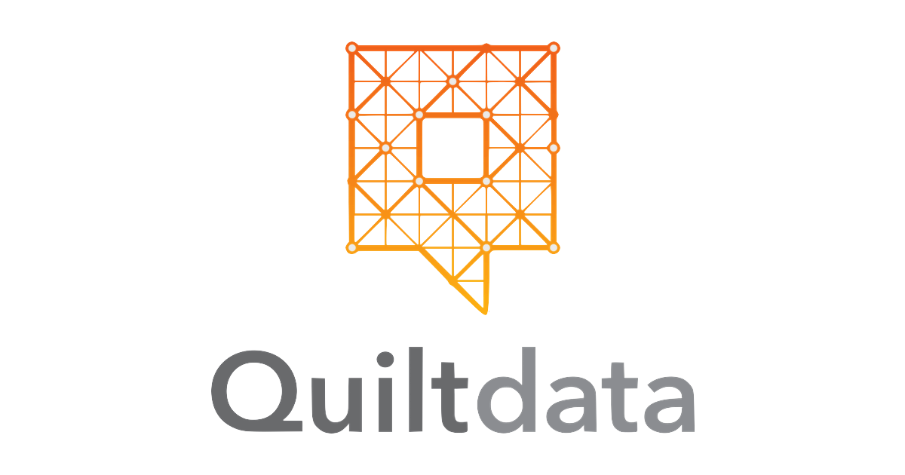

# Table of Contents 

1. [Description](README.md#description)
2. [Project Contribution](README.md#project-contribution)
3. [Known Issues](README.md#known-issues)
4. [Repo directory structure](README.md#repo-directory-structure)

## Description 

[Back to Table of Contents](README.md#table-of-contents)

### Rich Inman's Data Engineering Project for Insight-SV-Jan-2017.

The project was a consulting project for a company called [Quilt Data](https://www.quiltdata.com) that took place over the course of three weeks.

`quilt` is the command-line client that builds, retrieves, and stores packages. 
Prior to my [Insight Data Engineering project](http://insightdataengineering.com/), `quilt` contained a Python client that allowed users working in python on a single machine to quickly and easily import data into Pandas DataFrames. For this purpose `quilt` stored data frames in a high-efficiency, memory-mapped binary format known as [HDF5](https://support.hdfgroup.org/HDF5/). This provided access to data frames [5X to 20X faster](http://wesmckinney.com/blog/pandas-and-apache-arrow/).

Realizing that distributed conputing is quickly growing in popularity, Quilt Data decided that they would like to extend `quilt` client support to the [Apache Spark framework](http://spark.apache.org/), which was the primary thrust of my project.

## Project Contribution 
[Back to Table of Contents](README.md#table-of-contents)

### Serialization Format

[Apache Spark](http://spark.apache.org/) does not currently support [HDF5](https://support.hdfgroup.org/HDF5/) serialization. The addition of this feature would require the modification of Spark's source code, which is written in [Scala](https://www.scala-lang.org/), and is beyond the scope of a three week project. As a result, the identification of suitable alternative for serialization was the primary concern. Realizing that the current data frames `quilt` supports are highly structured with schema that do not evolve over time, a columnar data store like [Parquet](https://parquet.apache.org/) was chosen in place of [HDF5](https://support.hdfgroup.org/HDF5/).

## Known Issues 
[Back to Table of Contents](README.md#table-of-contents)

- `Python 3.6` - Install fails due to missing HDF5 dependencies. Try Python 3.5. For example if you're using Anaconda, create a 3.5 environment: `conda create -n ENV python=3.5`.

## Repo directory structure 
[Back to Table of Contents](README.md#table-of-contents)

My Repo Structure

	├── README.md 
	├── __init__.py
	├── .gitignore
	├── images
	|   └── quilt_logo.pdf
	└── data_tools
	|   └── cpr_annual_csv.m
	|   └── read_parquet.py
	└── quilt
	    └── __init__.py
	    └── data.py
	    └── test
	    |    └── __init__.py
	    |    └── build.yml
	    |    └── gen_data.py
	    |    └── test_build.py
	    |    └── test_command.py
	    |    └── test_gen_data.py
	    |    └── test_signature.py
	    |    └── data
	    |        └── 10KRows13Cols.csv
	    |        └── 10KRows13Cols.tsv
	    |        └── 10KRows13Cols.xlsx
	    |        └── foo.csv
	    |        └── nuts.csv
	    └── tools
	        └── __init__.py
	        └── build.py
	        └── command.py
	        └── const.py
	        └── hashing.py
	        └── sign.py
	        └── store.py
	        └── util.py
